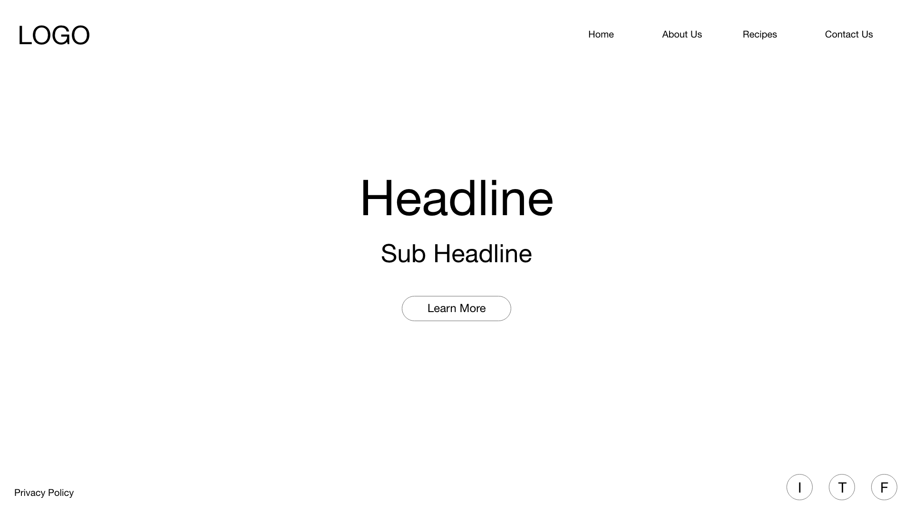
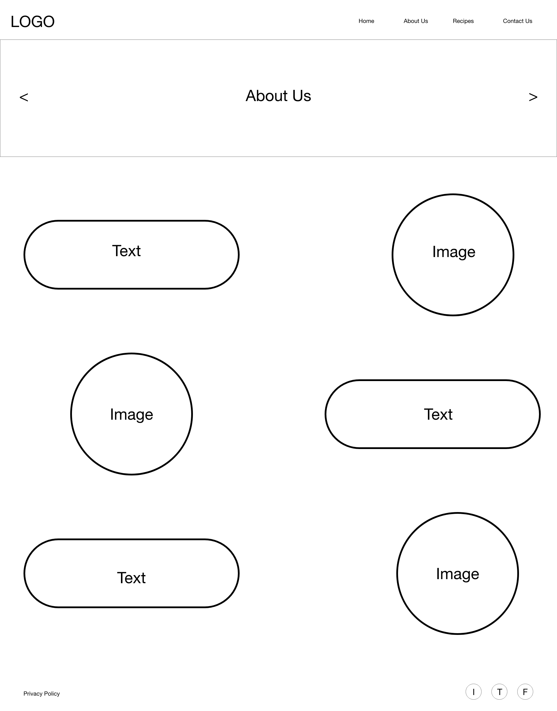
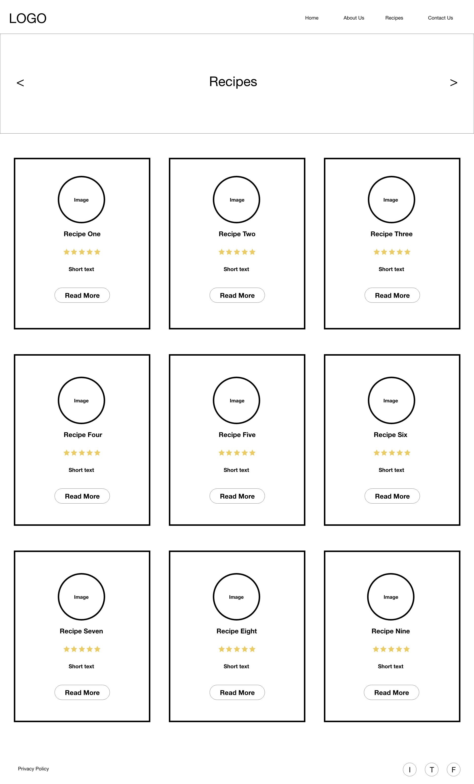
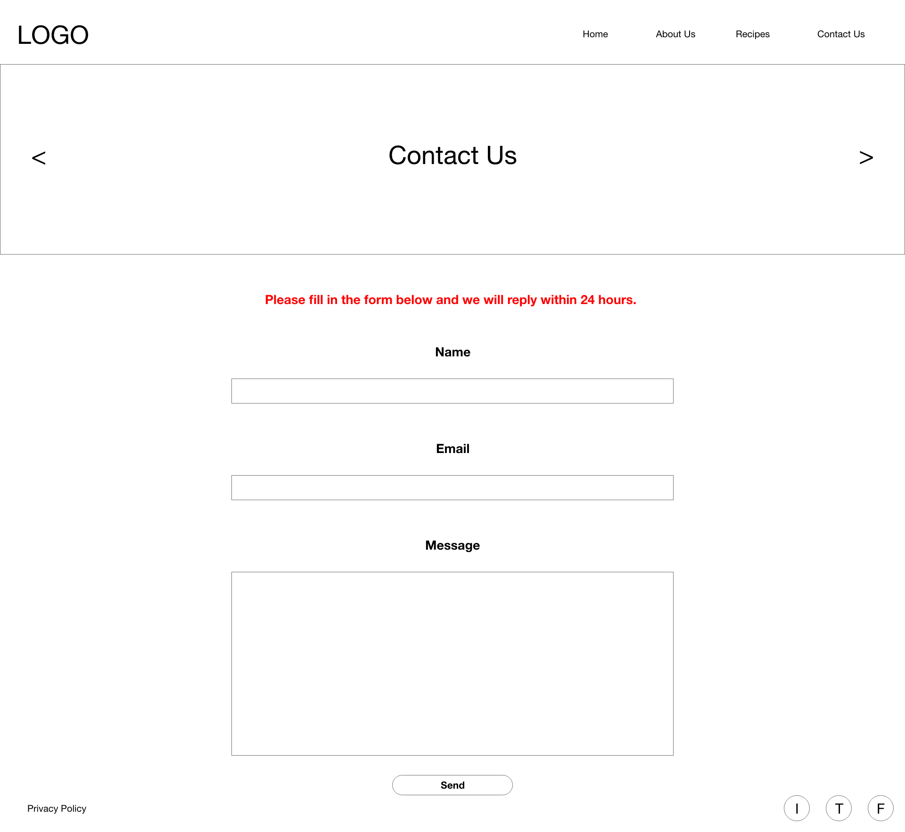
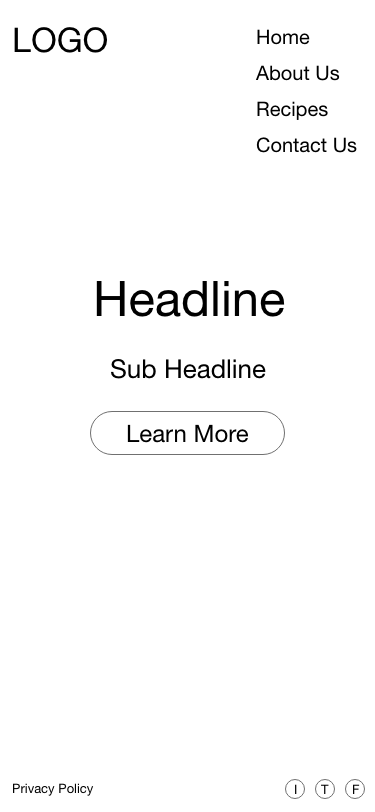
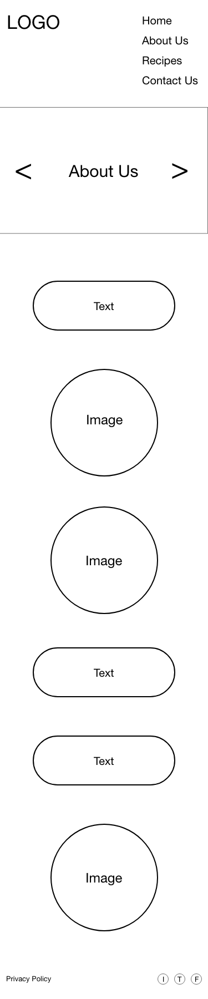
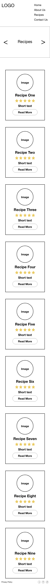
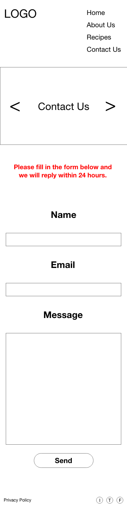
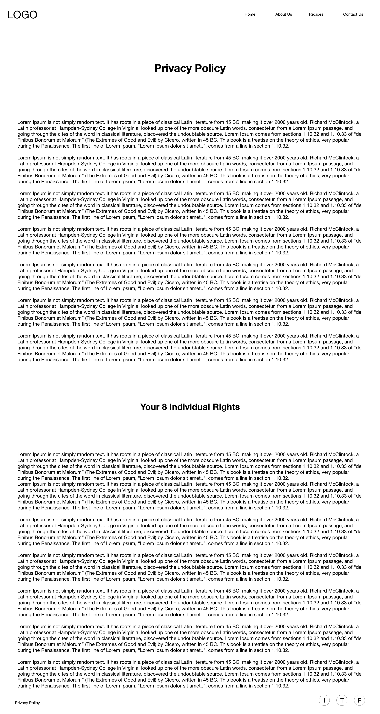

# Vegan Detox Website

## 1.1.1 Background
The purpose of creating this website is to generate awareness for veganism and outline its health benefits, 
how we perceive the lifestyle and dispel myths that surround it. As per the specification this website must include HTML, CSS & elements of JavaScript.
The final product will also need to be mobile and desktop responsive. 

## 1.1.2 WireFrames

## 1.1.3 Colour Choices
##### 1) Black - #000000
With the exception of the red text on the Contact Us Page, black will be used for all text e.g. paragraphs, headings, and navbar tabs. 

##### 2) Red - #cc0000
Used to highlight the importance of filling out the form on the Contact Us page. 

##### 3) White - #ffffff
Applied to the background of each page to create the illusion  of negative space, as well as a textual hover effect for all buttons. 
Also used as the background for articles found on the Recipes and About Us pages. 

##### 4) Green - #86be47
Used as an animated css hover effect on the navbar and as the default background for buttons on all pages.
Also used as a shadow effect for the textboxes on the About Us page.

## 1.1.4 Accessibility
The following measures have been taken to ensure that Vegan Detox adheres to W3C's accessibility standards.
##### 1) Bright colours for short-sighted people
Bright red, green, and white are used throughout the website to ensure that each component is visible for the user and accessible if needs be. 

##### 2) Understandable e.g. to the point and not overly complicated
Only the bare minimum of text is available on the website. This is so as not to overburden the user with information. Less is more in this case.
Furthermore, just as much information is visually conveyed, if not more. 
 
In addition, users also have the option to use the zoom in/out function on their PCs if they'd prefer to increase/decrease the size of the text. 

## 1.2.5 GDPR
##### 1) Creating a privacy policy
In order to ensure users can trust the legitimacy of Vegan Detox a privacy policy was created.
This is a legal requirement even though the site is not ecommerce related. As long as personal information is being collected e.g. email addresses, 
then a policy will be required to specify that we will not share or sell any personal information to third parties.  

Images of the privacy policy can be seen below: 

## 1.2.6 Distance Selling
Vegan Detox is not an ecommerce site; therefore, no information was conveyed in relation to distance selling.

## 1.2.7 Evaluation
#### To what extent did you tackle the problem that you set out to solve?
The subject tackled here is veganism and the objective is to assist in maintaining a vegan diet, a healthier lifestyle, and dispel myths associated with the consumption of its products, while encouraging users to try new meals that require little preparation. 

#### What problems did you encounter along the way?
Not many problems arose during the development of this site, however, there were times when it became problematic to validate the HTML to conform to W3C’s standards. For example, some of the code that had been composed was inaccurate and required further revision. The primary culprit for this was the JavaScript sliders found on all pages except the index and privacy policy. 
Being less familiar with JS than HTML and CSS did prove challenging, but after watching various YouTube videos and reading a book on JavaScript by Jon Duckett the sliders became slightly easier to incorporate, that’s not to say they still weren’t challenging, but looking back now they do make the website appear more aesthetically pleasing, which hopefully will result in a steady stream of traffic.

#### How did you test your website/web-application on multiple devices, and what did you find out?
When testing the website’s responsivity Cloud9’s was used to run the application, both in its preview setting and on the Google Chrome browser. This was necessary to ensure all that nothing was out of place or missing from the code e.g. images. 
During this process numerous flaws were discovered that required fixing. The most frequent of flaws was the navigation bars used on all pages. The idea behind this was to place the logo in the left corner of the screen and the tabs on the right. This proved excessively difficult and took quite a bit of time to facilitate, specifically on the media query for the mobile versions. For example, the desktop version of the navbar had the tabs on the right inline to demonstrate a clean and uncluttered look, however, the mobile version used block level elements instead so all the tabs would fit on the screen and appear uncluttered for the user. 
Looking back on it now this was probably a mistake and a hamburger menu should have been applied instead since it is more user friendly. If the hamburger menu had been used instead then Font Awesome would be used to apply the image of the menu and then CSS coding would be applied to store the tabs inside. This probably should be something to consider next time a website needs developing. 

#### What informed your design choices?
From February-April 2019 I challenged myself to try veganism. During this time my body felt better for it, I had more energy. Not only that, but the variety of delicious recipes which be found online surprised me. 
This is how the idea of creating a website that offers various recipes and allows users to send in their own (on our approval) was formulated.          
Regarding the wireframes and the final design for Vegan Detox, the idea was to utilize common UX themes e.g. negative space on the About Us page, limited text and bright colours with good visual appeal. The bright colours would make the site not only appear attractive for casual viewers, but also useable for those with disabilities e.g. short-sighted individuals, thus conforming to W3C’s accessibility standards. 

One part of the development process I am particularly proud of is the animation effects that occur when the user hovers over the navbar. This occurs both on the desktop and mobiles versions. 
Being an avid fan of UX this felt like an essential inclusion to the website. That said, it took a while to fully grasp how to create these effects in CSS. To learn the machinations of the code various YouTube videos were watched. These included: ??

Another aspect of the development process which (in my opinion) went well was the consistent use of the colour green. This was used as a shadow effect for articles, the default colour for buttons, the hover effect on the navbar, and the colours used for the company logo. Speaking of which, the logo was a bespoke creation made using only Adobe Illustrator.
While the finished version of Vegan Detox incorporates a modern feel and links to various recipes online, the social media buttons remain static. The reason for this is because this website is merely an assignment project there didn’t seem much point in creating them. The icons are merely decorative. However, if this site was ever to become a real blog an advocate for veganism then these links would be an integral method to garner traffic and build relationships with existing fans of the business, but because the site is static at present these icons are only there to add to the visual appeal. 
