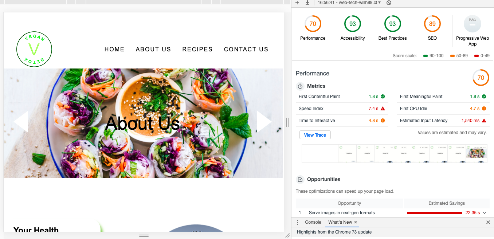
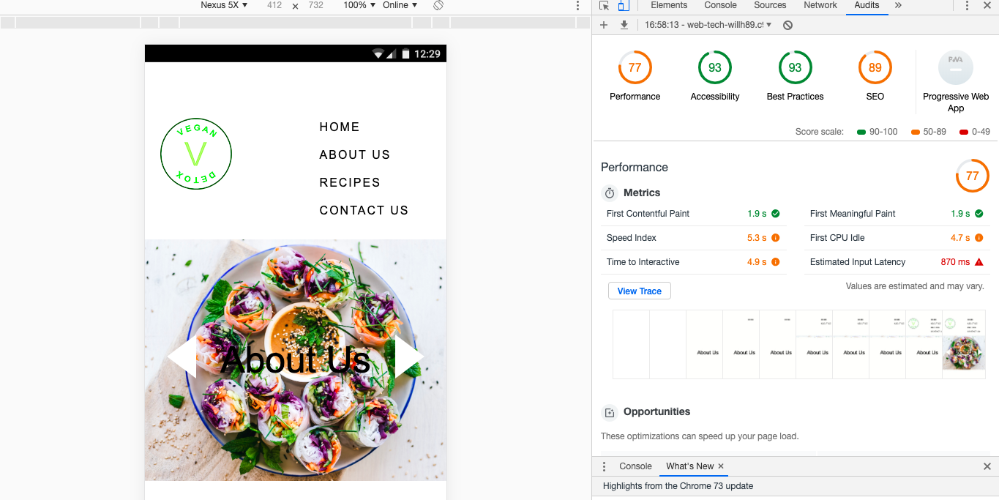
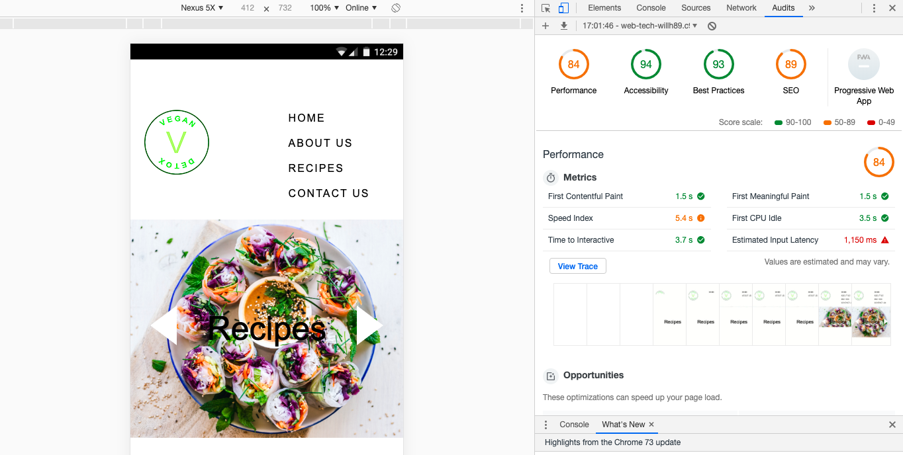

# Vegan Detox Website

## 1.1.1 Background

The purpose of creating this website is to generate awareness for veganism by showcasing nutritious recipes for quick and tasty meal preparation. The website includes HTML, CSS & two forms of JavaScript e.g. a slider and form requirements. The final product will be mobile and desktop responsive.

## 1.1.2 WireFrames

## 1.1.3 Colour Choices
##### 1) Black - #000000
Used for all paragraphs, headings, navbar tabs, and a hover effect for all buttons.

##### 2) Red - #cc0000
Text used to highlight the importance of filling out the form on the Contact Us page.

##### 3) White - #ffffff
Applied to the background of each page to utilize negative space, also used as the background for articles found on the Recipes and About Us pages.

##### 4) Green - #86be47
Used as an animated hover effect on the navbar and as the default background for buttons on all pages. Also, used as a shadow effect for the textboxes on the About Us and Recipe pages.

## 1.1.4 Accessibility
The following measures have been taken to ensure that Vegan Detox adheres to W3C's accessibility standards.

##### 1) Bright colours for short-sighted people
Bright red, green, and white are used throughout the website to ensure that each component is visible for the user and accessible if needs be. 

##### 2) Understandable e.g. to the point and not overly complicated
Only the bare minimum of text is available on the website. This is so as not to overburden the user with information. Less is more in this case.
Furthermore, just as much information is visually conveyed, if not more. 
 
Users also have the option to use the zoom in/out function on their PCs if they'd prefer to modify the size of the text. 

## 1.2.5 GDPR
##### 1) Creating a privacy policy
To ensure users can trust the legitimacy of Vegan Detox a privacy policy was created.
This is a legal requirement even though the site is not ecommerce related. As long as personal information is being collected e.g. email addresses, 
then a policy will be required to specify that we will not share or sell any personal information to third parties.  

Low-fidelity-wireframes can be seen below:

## 1.2.6 Distance Selling
Vegan Detox is not an ecommerce site; therefore, no information was conveyed in relation to distance selling.

## 1.2.7 Evaluation

#### To what extent did I tackle the problem that I set out to solve?
To raise awareness for veganism, a recipes page was created to provide users with alternative options for meal preparation. 

#### What problems were encountered along the way?
Few issues arose during the development stage, however, there were times when it became problematic to validate the HTML to conform to W3C’s standards. Some of the code that’d been composed was inaccurate and required further revision. The primary culprit was the JavaScript sliders found on all HTML pages except the index, message, and privacy policy. Being less familiar with JS than HTML and CSS proved challenging, but after reading a book called “JavaScript & jQuery” by Jon Duckett the sliders became easier to incorporate, that’s not to say they still weren’t challenging, but looking back I do believe they make the website appear more aesthetically pleasing, which hopefully will result in a steady stream of traffic.

JavaScript was also used on the Contact Us page to ensure the user types more than five characters in all boxes. The purpose of which was to collect as much information as possible with a degree of accuracy. Incorporating this code was straightforward and required little effort, however, problems began to arise when the user submitted the form. The idea had been to send the user to a separate page which reads “Your form has been successfully submitted!”. However, an error was made, because I’d forgotten to include the IDs on the HTML page, so when the external JS file that’d been created was called the screen showed “Page Cannot be Displayed”. After scanning the documents, I realised the error I’d made and when the IDs had been added the form executed the separate JS file correctly.

Other issues that arose during this process were the navigation bars used on all pages. The idea had been to place a logo in the left corner of the screen and the tabs on the right. This proved excessively difficult and took time to facilitate, specifically on the media query for the mobile version. For example, the desktop version of the navbar had the tabs on the right inline to demonstrate a clean and uncluttered look, however, the mobile version used block-level elements instead so all the tabs would fit on the screen and appear uncluttered for the user. 
Upon reflection, this was a mistake and a hamburger menu should have been applied instead since it is more user friendly and commonly used in the industry. If the hamburger menu had been utilized instead then Font Awesome would be used to apply the image of the menu and CSS would be added to store the tabs inside. This should be something to consider next time.

#### How did I test the website/web-application on multiple devices, and what was discovered? 
When testing the website’s responsivity Cloud9 was used to run the application, both in its preview setting and on the Google Chrome browser. This was necessary to ensure that nothing was out of place or missing from the code e.g. images or links. In addition, various screen sizes were used to test the application. This felt necessary, because the MacBook which was used to code this website only has a thirteen-inch screen. 

After being tested on PCs, Macs, MacBooks, and an iPhone X it became apparent that almost everything functioned ok. One minor thing which kept popping up was the Home page on PCs and Macs e.g. the heading, sub heading, and button are positioned too high and not quite centred. Attempts to fix this issue were tried, however, when implemented the code compromised how the page is viewed on other devices. I was unable to fix this issue.

Below are some screenshots, which indicate how well the website performed when audits were undertaken using the "inspect" option in Google Chrome. The outcome of these results was positive e.g. no issues were highlighted in red. If they were that would mean they would either run very slow or something needed amending in the script. 

The lowest score was 68 for accessibility on the Contact Us page (desktop). The reason listed for why the score was lower than previous tests was because headings were not included on the page, and the Lang tag was missing from the HTML document, to attribute it to the English language. Despite this, no page tested lower than 68 and with 21 tests coming up green and 19 coming up orange no further modification was needed. See screenshots below:

#### What informed my design choices?
The idea was to utilize trending UI themes e.g. animation for the navbars and negative space on the About Us page. Furthermore, the entire site used limited text and bright colours with good visual appeal. The bright colours would make the site not only attractive for casual viewers, but also useable for those with disabilities e.g. short-sighted individuals, thus conforming to W3C’s accessibility standards.

Being a fan of UX/UI and having seen animation effects used on other websites over the years I felt compelled to use it on this project somehow. That said, it took some time to comprehend how to create these effects in CSS. MDN (Mozilla Developer Network) was used to understand how to scale and configure the keyframes correctly.

Plants, which are associated with veganism influenced the use of the colour green. This colour was used as a shadow effect for articles, the default colour for buttons, the hover effect on the navbar, and the colours used for the company logo. 
The logo was a bespoke creation made with Adobe Illustrator, inspired by various coffee shop logos e.g. Café Thrive and Starbucks. The final version of Vegan Detox incorporates a modern feel; however, the buttons on the Recipes Page don’t link to anything yet and the social media buttons remain static. This is because the website is an assignment project and external sources weren’t a necessity in the criteria, but if the site was ever to become a real blog and advocate for veganism then these links would be an integral part to garner traffic and establish relationships with fellow fans of veganism.
